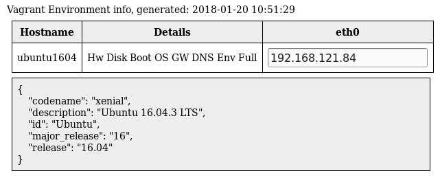

# Vagrant info via Ansible

Generates HTML file with vagrant environment by using vagrant provisioner ansible-remote.
It will generate table with info about hosts managed by vagrant.

Example:



Clicking on Details will show different contents.

# Requirements and known limitations

Your host used to run vagrant commands needs to have ansible installed.
Using ansible as remote provisioner via ssh.
This was tested under *nix systems, it might work under Windows + Ubuntu shell but it really depends on ansible itself.
Maybe it should be changed to ansible-local provisioner....

# Installation

We assume that your project is in `~/src/proj` directory.

* Create `~/src/proj/ansible` directory.

```bash
mkdir -p ~/src/proj/ansible
```

* Create `~/src/proj/ansible/roles` directory, put there `vagrant_info` ansible role. You can do this by just cloning a repo:

```bash
git clone https://github.com/nvtkaszpir/ansible_vagrant_info.git ~/src/proj/ansible/vagrant_info
```

* Copy ansible playbook from `~/src/proj/ansible/vagrant_info` to `~/src/proj/ansible/vagrant_info.yml`:

```bash
cp ~/src/proj/ansible/vagrant_info ~/src/proj/ansible/vagrant_info.yml
```


* Modify `Vagrantfile`, add at the very end of the `Vagrant.configure` config section below code:

```ruby
config.vm.provision "info", type: 'ansible' do |ansible|
    ansible.limit    = "all"
    ansible.verbose  = true
    ansible.playbook = "ansible/vagrant_info.yml"
end
```

This adds additional provisioning step.

* Add `~/src/proj/ansible.cfg` file:

```ini
[defaults]
gathering = smart
log_path = ansible.log
nocows = yes
retry_files_enabled = False
jinja2_extensions = jinja2.ext.do
ansible_managed = "This file is MANAGED BY ANSIBLE, all changes will be LOST upon an update."
host_key_checking = false
inventory = .vagrant/provisioners/ansible/inventory/vagrant_ansible_inventory

[ssh_connection]
ssh_args = -o ControlMaster=auto -o ControlPersist=60s -o ControlPath=/tmp/ansible-ssh-%r-%h-%p
pipelining = True

```

# Running

To execute vagrant provisioners and generate `~/src/proj/ansible/vagrant_info.html`, run

```bash
vagrant provision
```

To generate only HTML report and not to trigger other provisioners, run:

```bash
vagrant provision --provision-with=info
```

You can also run it without invoking vagrant at all:

```bash
ansible-playbook -i .vagrant/provisioners/ansible/inventory/vagrant_ansible_inventory ansible/vagrant_info.yml
```

# Customization

See `templates/vagrant_info.html.j2` - this is simple Jinja2 template to generate HTML report. Adjust to your needs.
You could for example add URLs to exposed HTTP services in vagrant.
Watch out tor undefined ansible variables, though.

# Other usage

You could run this role and playbook on non-vagrant environment as well, so you could create simple status page for hosts.
Yet, there are better tools for that like:
* [Ansible Tower](https://www.ansible.com/products/tower) or alternatively [Ansible AWX](https://github.com/ansible/awx)
* [Ansible CMDB](https://github.com/fboender/ansible-cmdb) for more advanced setups and details.
